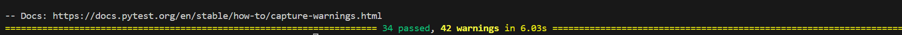
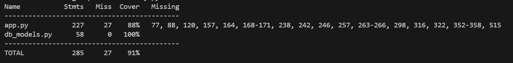

# POLECENIE

**Zakres realizacji projektu: Back-End z bazą danych, Front-End z aplikacją internetową (przez 
przeglądarkę) i mobilną (na urządzenia mobilne z systemem operacyjnym Android). Pokrycie 
kodu testami w 60% (aplikacja internetowa i Back-End w Pythonie).**


Portal agrarny (sprzedaż produktów rolnych; kalendarz transportów – co, do jakiej 
lokalizacji, kiedy, w jakiej ilości – odpowiedni samochód do transportu)
Wymagane funkcje: 
1. Zakładanie konta użytkownika,
2. Uwierzytelnienie (Logowanie),
3. Przeglądanie dostępnych produktów (opis, zdjęcie) i ich cen, 
4. Zamawianie transportu – co (jaki produkt), kiedy (kalendarz), dokąd, środek 
transportu (flota ciężarówek),
5. Generowanie raportów per okres (liczba transportów, wartość transportu, 
województwo/powiat miejsca docelowego transportu)


# Docker

Docker uruchamia backend w python Flask na porcie 5000 oraz aplikację webową javascript React na porcie 3000.

```sh
docker-compose up --build
```


## todo

#### + = done

| ID  | Backend | Web | Mobile |
|-----|---------|-----|--------|
| 1   |    +    |  +  |    +   |
| 2   |    +    |  +  |    +   |
| 3   |    +    |  +  |    +   |
| 4   |    +    |  +  |    +   |
| 5   |    +    |  +  |    +   |


# Backend
<div style="color: white; background-color: red; padding: 15px; border-radius: 5px; font-size: 1.2em; font-weight: bold;">
⚠️ Dokumentacja każdego endpointu jest w backend/app.py
</div>


<div style="color: white; background-color: red; padding: 15px; border-radius: 5px; font-size: 1.2em; font-weight: bold;">
⚠️enumy sa case senstivie jak cos zrobicie inaczej to zwrocone zostanie 400, na samym dole definicja tych enumow!
</div>

## Uruchomienie 

### normalnie

install requierements.txt i:
```sh
python .\main.py
```

### docker
```sh
docker build -t uaimproj .
docker run -d -p 5000:5000 --name uaim-proj-rel uaimproj
```

## testy

### uruchomienie testow
```sh
pytest tests.py
```


### pokrycie kodu testami 91%
```sh
pytest .\tests.py --cov=app --cov=db_models --cov-report=term-missing
```



## wspomniane enumy
```python
class Province(Enum):
    DOLNOSLASKIE = "dolnośląskie"
    KUJAWSKOPOMORSKIE = "kujawsko-pomorskie"
    LUBELSKIE = "lubelskie"
    LUBUSKIE = "lubuskie"
    LODZKIE = "łódzkie"
    MAŁOPOLSKIE = "małopolskie"
    MAZOWIECKIE = "mazowieckie"
    OPOLE = "opolskie"
    PODKARPACKIE = "podkarpackie"
    PODLASKIE = "podlaskie"
    POMORSKIE = "pomorskie"
    SLASKIE = "śląskie"
    SWIETOKRZYSKIE = "świętokrzyskie"
    WARMINSKOMAZURSKIE = "warmińsko-mazurskie"
    WIELKOPOLSKIE = "wielkopolskie"
    ZACHODNIOPOMORSKIE = "zachodniopomorskie"

class TransportType(Enum):
    PICKUP = "PICKUP"
    TRUCK = "TRUCK"
    COURIER = "COURIER"
```

# Web

# Mobile
